# AI-Tutor
Description: An AI-powered tutor application with multiple LLM providers, study planning, quizzes, RAG, and automation.
<div align="center">

# 🎓 Enterprise AI Tutor

<div align="center">

<a href="https://github.com/satya66123/AI-Tutor">
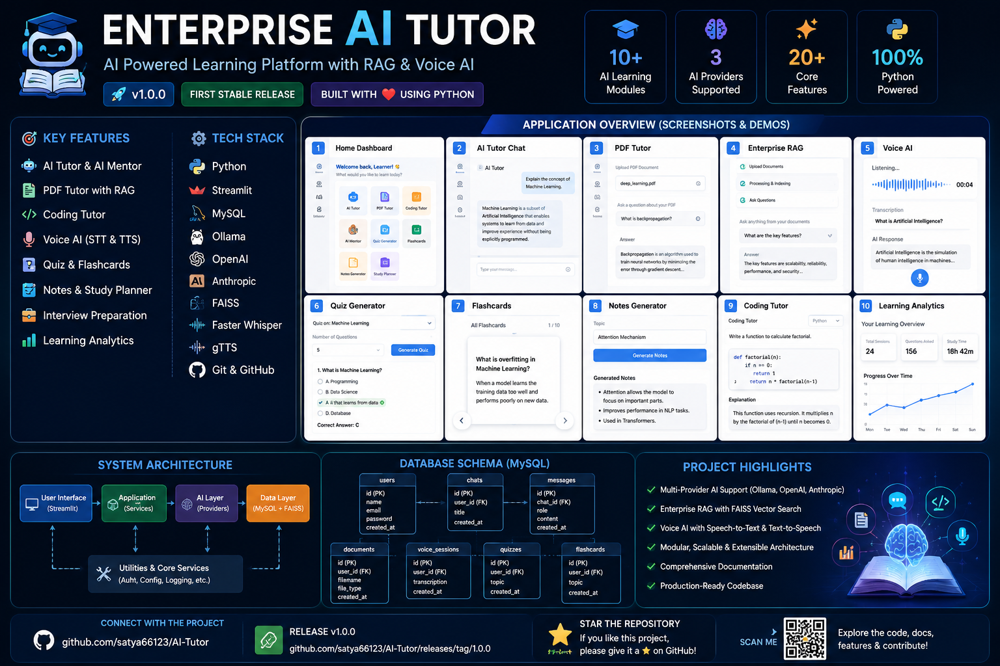
</a>

</div>

### An Enterprise-Grade AI Learning Platform Powered by Multiple LLM Providers

AI Tutor • Enterprise RAG • Voice AI • Study Planner • Learning Analytics • Interview Preparation

---


</div>

---

# 📖 Overview

Enterprise AI Tutor is a modern AI-powered learning platform designed to provide an intelligent, interactive, and personalized educational experience.

The platform combines multiple Large Language Model (LLM) providers with Retrieval-Augmented Generation (RAG), Voice AI, study tools, learning analytics, and interview preparation to create an enterprise-grade learning ecosystem.

---

# ✨ Key Highlights

- 🎓 Intelligent AI Tutor
- 📚 Enterprise Retrieval-Augmented Generation (RAG)
- 🎤 Voice AI Tutor
- 🧠 AI Mentor
- 💼 Interview Preparation
- 📄 PDF Tutor
- 💻 Coding Tutor
- 📝 Quiz Generator
- 🃏 Flashcards
- 📒 Notes Generator
- 📅 Study Planner
- 📈 Learning Analytics
- 📚 Learning History
- ⚙ Multi-Provider AI Support

---

# 🚀 Features

## AI Learning

- AI Tutor
- AI Mentor
- Voice AI Tutor
- Interview Preparation

---

## Study Tools

- Study Planner
- Revision Planner
- Quiz Generator
- Flashcards
- Notes Generator

---

## Learning Modules

- PDF Tutor
- Coding Tutor
- Learning Analytics
- Learning History

---

## Enterprise AI

- Enterprise RAG
- Semantic Retrieval
- Keyword Retrieval
- Hybrid Search
- Parent-Child Retrieval
- Multi Query Retrieval
- HyDE Retrieval
- Citation Generation
- Memory
- Cache
- Token Usage

---

## Voice AI

- Speech-to-Text
- Text-to-Speech
- Voice Conversations
- Voice History
- Voice Analytics
- Session Management

---

# 🏗️ Architecture

```text
                        Enterprise AI Tutor

                                │
        ┌───────────────────────┴──────────────────────┐
        │                                              │
   Streamlit UI                                Enterprise Services
        │                                              │
        ├─────────────── AI Providers ─────────────────┤
        │                                              │
     Ollama             OpenAI                 Anthropic
        │                                              │
        └───────────────────────┬──────────────────────┘
                                │
                         Enterprise RAG
                                │
      Semantic • Hybrid • Parent Child • HyDE • Multi Query
                                │
                         FAISS Vector Store
                                │
                             MySQL Database
```

---

# 🛠️ Technology Stack

| Category | Technology |
|-----------|------------|
| Programming Language | Python |
| Framework | Streamlit |
| Database | MySQL |
| Vector Store | FAISS |
| Speech Recognition | Faster Whisper |
| Text To Speech | gTTS |
| AI Providers | Ollama, OpenAI, Anthropic |

---

# 📂 Project Structure

```text
AI-Tutor/
│
├── app.py
├── config/
├── database/
├── docs/
├── models/
├── pages/
├── prompts/
├── services/
├── ui/
├── uploads/
├── utils/
├── vector_store/
├── logs/
├── requirements.txt
└── README.md
```

---

## 📸 Application Screenshots

| Home | Dashboard |
|------|-----------|
| 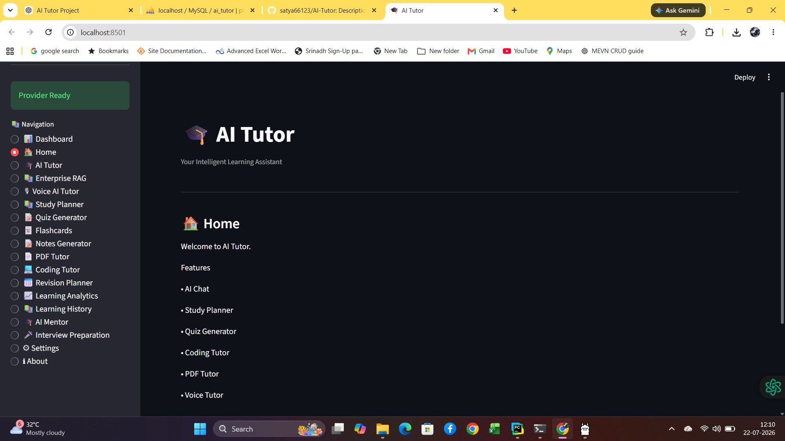 | 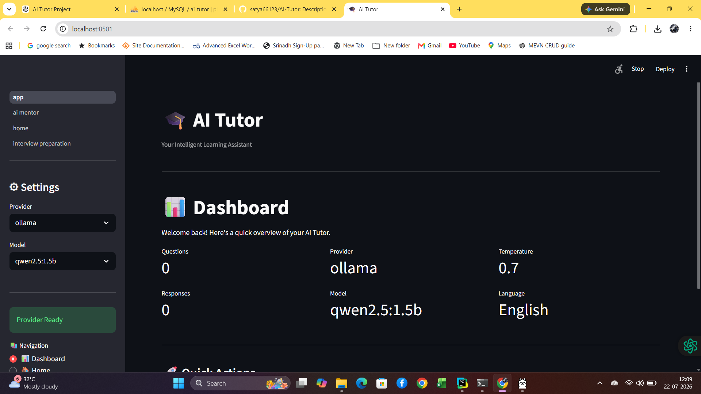 |

| AI Tutor | AI Mentor |
|----------|-----------|
| 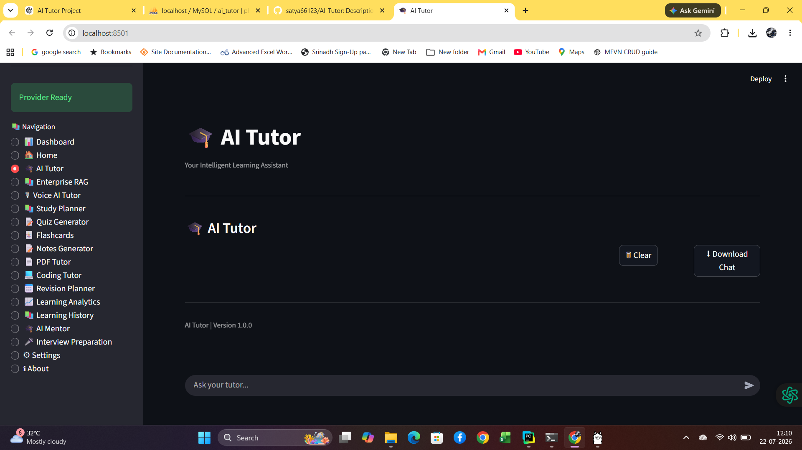 | 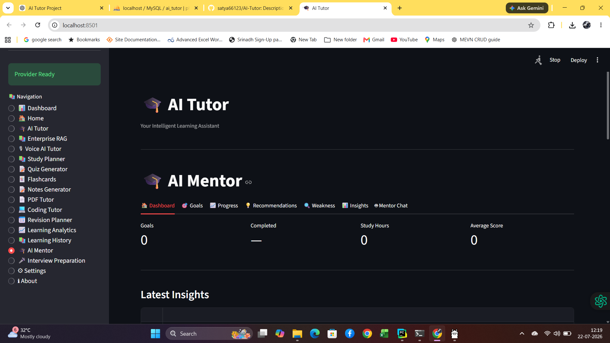 |

| PDF Tutor | Coding Tutor |
|-----------|--------------|
| 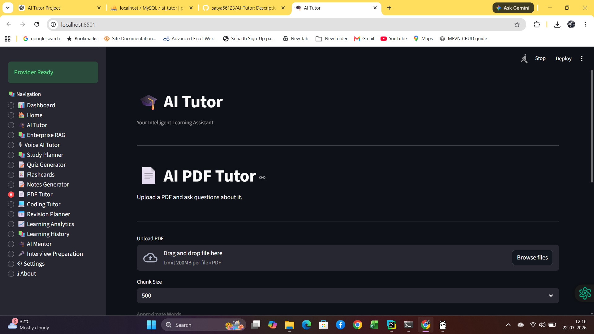 | 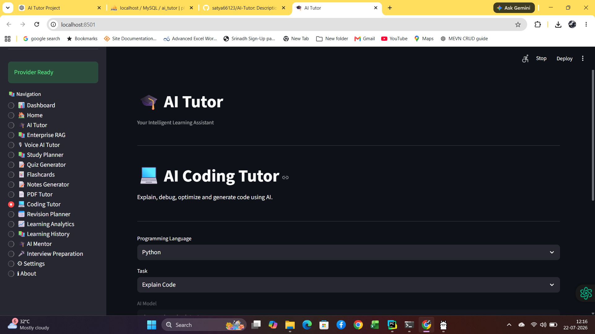 |

| Voice Tutor | Enterprise RAG |
|-------------|----------------|
| 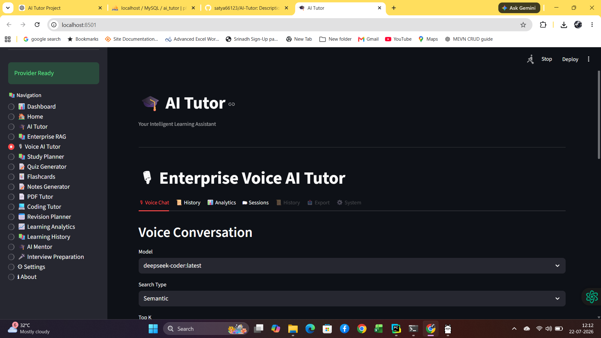 | 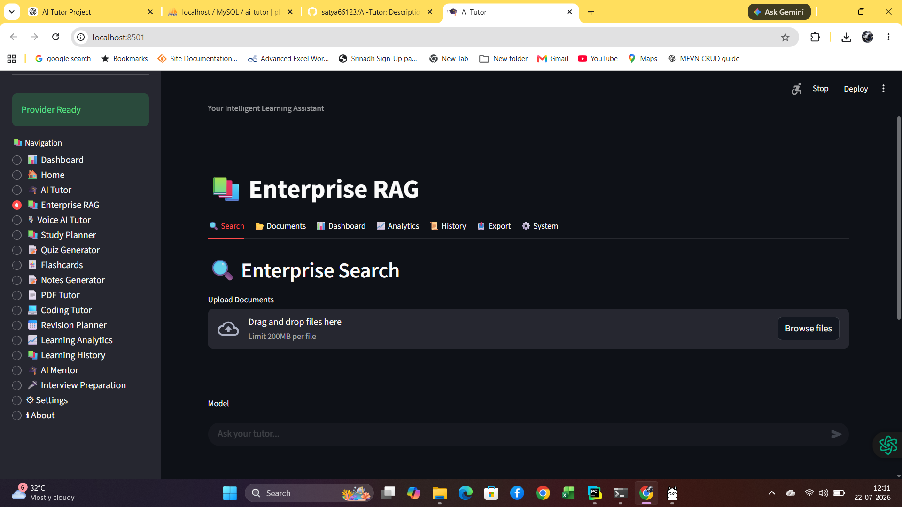 |

| Quiz | Flashcards |
|------|------------|
| 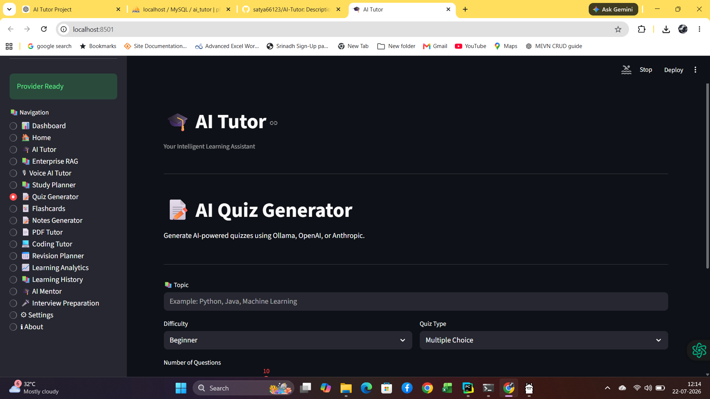 | 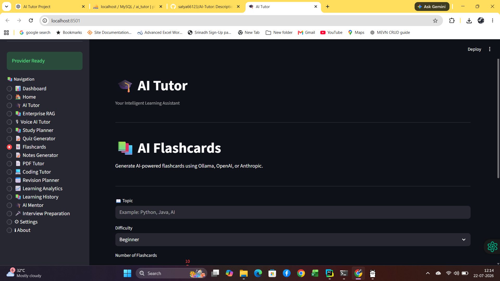 |

| Notes | Learning Analytics |
|-------|---------------------|
| 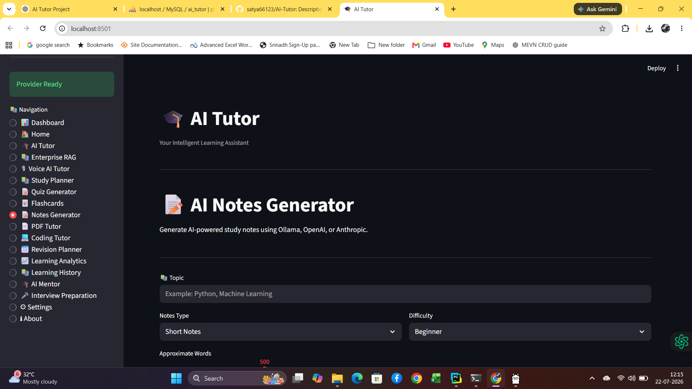 | 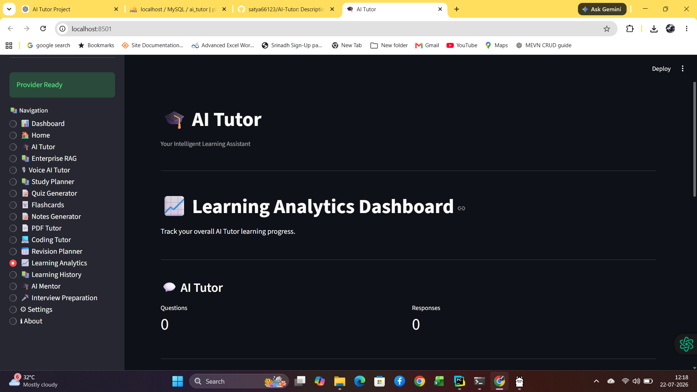 |

---

# 📦 Main Modules

| Module | Status |
|----------|:------:|
| Dashboard | ✅ |
| AI Tutor | ✅ |
| Enterprise RAG | ✅ |
| Voice AI Tutor | ✅ |
| AI Mentor | ✅ |
| Interview Preparation | ✅ |
| Study Planner | ✅ |
| Quiz Generator | ✅ |
| Flashcards | ✅ |
| Notes Generator | ✅ |
| PDF Tutor | ✅ |
| Coding Tutor | ✅ |
| Revision Planner | ✅ |
| Learning Analytics | ✅ |
| Learning History | ✅ |
| Settings | ✅ |
| About | ✅ |

---

# 📊 Project Statistics

| Metric | Value |
|---------|------:|
| Total Modules | 17+ |
| Pages | 18+ |
| Services | 50+ |
| Database Tables | 20+ |
| AI Providers | 3 |
| Retrieval Strategies | 6 |
| Voice AI Modules | 6 |
| Documentation | Complete |

---

# 📸 Screenshots

Screenshots will be added here.

- Dashboard
- AI Tutor
- Enterprise RAG
- Voice AI Tutor
- Study Planner
- Coding Tutor
- Learning Analytics

---

# 📚 Documentation

The complete project documentation is available in the **docs/** directory.

- FEATURES.md
- PROJECT_STRUCTURE.md
- ARCHITECTURE.md
- SYSTEM_DESIGN.md
- DATABASE.md
- RAG_ARCHITECTURE.md
- VOICE_AI_TUTOR.md
- PROVIDER_GUIDE.md
- INSTALLATION.md
- USER_GUIDE.md
- API_DOCUMENTATION.md
- CHANGELOG.md
- RELEASE_NOTES.md
- CONTRIBUTING.md
- FAQ.md
- TROUBLESHOOTING.md

---

# 🛣️ Project Roadmap

| Phase         |   Status    |
|---------------|:-----------:|
| General Setup | ✅ Completed |
| Phase 1       | ✅ Completed |
| Phase 2       | ✅ Completed |
| Phase 3       | ✅ Completed |
| Phase 4       | ✅ completed |

---

# 🌟 Future Enhancements

- Cloud deployment
- Mobile companion application
- Plugin architecture
- Additional AI providers
- Enhanced collaborative learning

---

# 🤝 Contributing

Contributions, suggestions, and improvements are welcome.

Please read **CONTRIBUTING.md** before submitting a pull request.

---

# 📄 License

This project is licensed under the MIT License.

---

<div align="center">

### ⭐ If you found this project useful, consider giving it a Star!

**Built with ❤️ using Python, Streamlit, MySQL, FAISS, Ollama, OpenAI & Anthropic**

</div>